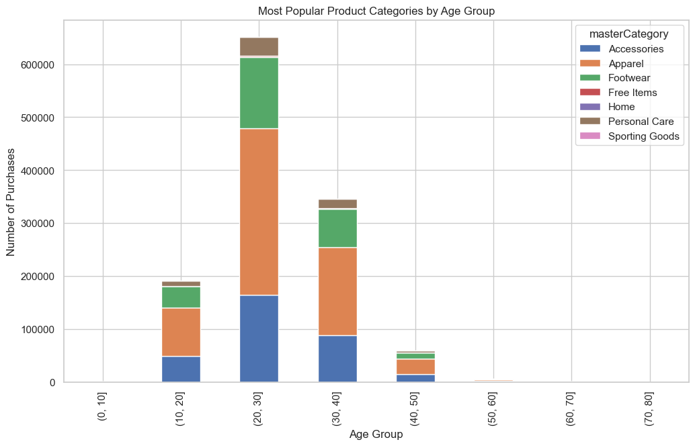
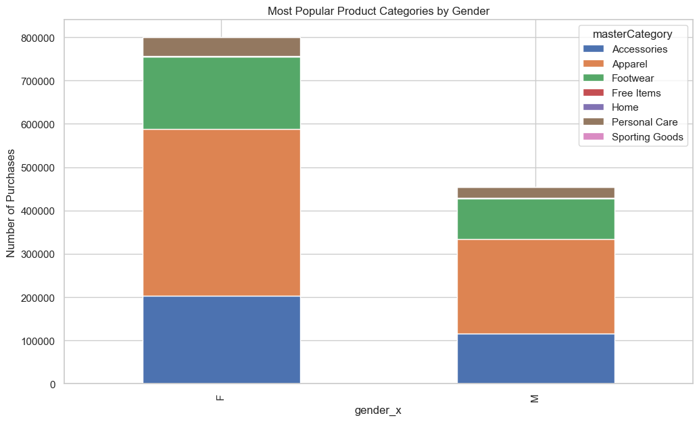
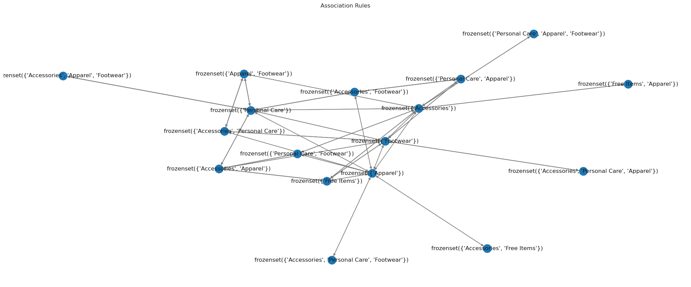
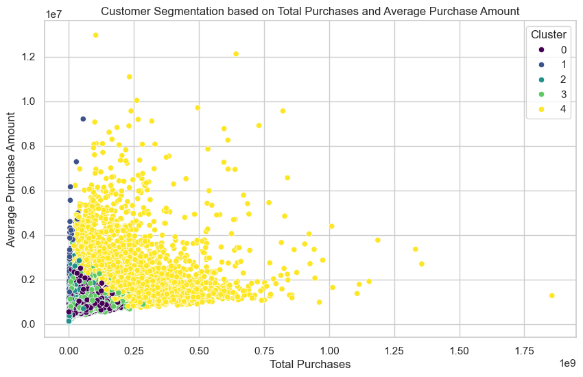
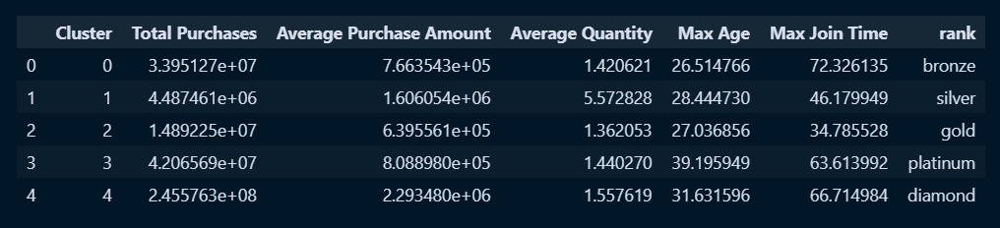
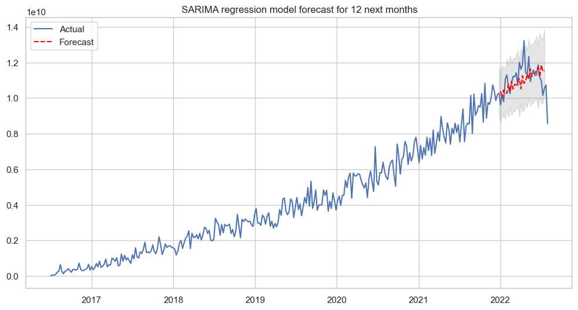
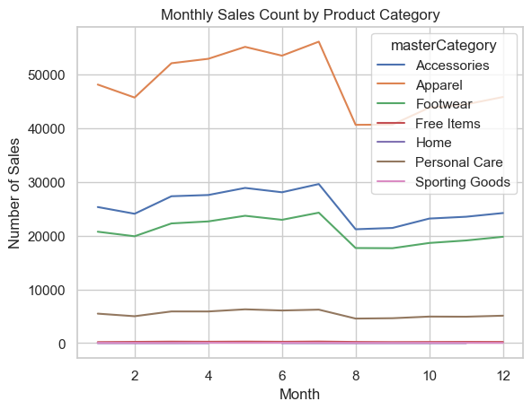
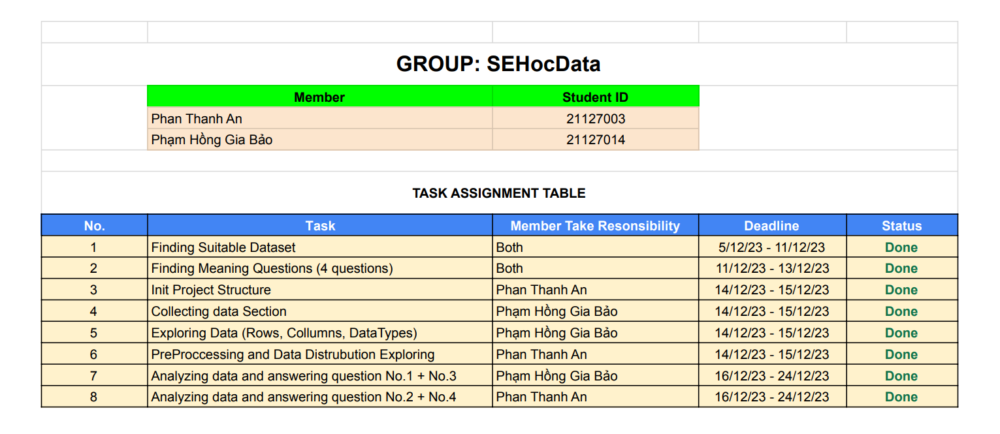

# PROGRAMMING FOR DATA SCIENCE - CSC17104_21KHDL1 - FITHCMUS

## Final Project nhóm `SEHocData`

### I. Thông tin nhóm:

- Tên nhóm: `SEHocData`
- Lớp: 21KHDL1

| MSSV     | Họ tên            | Email                     |
| -------- | ----------------- | ------------------------- |
| 21127003 | Phan Thanh An     | ptan21@clc.fitus.edu.vn   |
| 21127014 | Phạm Hồng Gia Bảo | phgbao21@clc.fitus.edu.vn |

### II. Thông tin đề tài:

#### **_01. Dataset:_**

Bộ dữ liệu [Fashion Campus E-commerce Transactional Dataset](https://www.kaggle.com/datasets/bytadit/transactional-ecommerce?fbclid=IwAR0XVOD8Cv2IWJ2MtP0giIA11b6LlgOMzsjcGE7rObC08VmIQ8XnnfT2HGU) chứa thông tin của 100.000 khách hàng, 44.446 sản phẩm bán ra và 10.254.585 giao dịch được thu thập từ tháng 7 năm 2018 tới tháng 12 năm 2019 trên sàn thương mại điện tử Fashion Campus tại Indonesia.

#### **_02. Meaningful questions:_**

##### **_02.1. Question number 1: `What is the distribution of customer on avarage spending money and most favourite item by demographics?`_**

- **Nội dung**: Phân bố khách hàng theo độ tuổi và giới tính, số tiền mua trung bình theo nhóm tuổi hoặc giới tính và các loại sản phẩm phổ biến nhất ở các nhóm tuổi hoặc giới tính khác nhau.
- **Mục đích**: Chúng ta sẽ hiểu hơn về khách hàng, một số yếu tố như độ tuổi, giới tính và loại sản phẩm có thể tác động mạnh tới doanh thu công ty Fashion Campus.

##### **_02.2. Question number 2: `Which products are more inclined to be bought together?`_**

- **Nội dung**: Phân tích những sản phẩm hoặc nhóm sản phẩm thường xuyên mua cùng nhau bằng thuật toán `Apriori` từ đó đề xuất các sản phẩm bổ sung dựa trên lịch sử mua hàng của khách hàng.
- **Mục đích**: Tối ưu hóa chiến dịch tiếp thị, doanh nghiệp có thể xác định những chiến dịch tiếp thị hiệu quả nhất bằng cách tìm ra những quy luật kết hợp giữa các sản phẩm hoặc dịch vụ mà khách hàng thường mua. Điều này giúp tối ưu hóa ngân sách tiếp thị và tạo ra chiến dịch hiệu quả hơn.

##### **_02.3. Question number 3: `What is the customer segment that contributed the most to our company?`_**

- **Nội dung**: Phân khúc khách hàng dựa trên hành vi mua hàng, thông tin nhân khẩu học, xác định các phân khúc có giá trị cao đóng góp nhiều nhất vào doanh thu.
- **Mục đích**: Phát triển các chiến lược tiếp thị để giữ chân các khách hàng với từng phân khúc cụ thể.

##### **_02.4. Question number 4: `How do monthly or weekly sales trends manifest in the total sales figures? Are there forecasts for future sales?`_**

- **Nội dung**: Chúng ta sẽ xác định xu hướng hàng tháng hoặc hàng tuần trong tổng doanh số bán hàng, từ đó dự đoán ra doanh số bán hàng qua mô hình Arima. Ngoài ra chúng ta sẽ xem xét ngành hàng nào được bán chạy nhất theo thời gian.
- **Mục đích**: Dự đoán được doanh thu của công ty từ đó có thể đưa ra các chiến lược bán hàng hợp lý
  => ta nhận thấy lượng toltal sales tăng dần theo năm, tuy nhiên đến giữa khoảng 2022 có dấu hiệu đi xuống, vì thế chúng tôi tập trung đẩy mạnh vào marketing nhằm nâng cao doanh thu mua hàng

#### **_03. Questions analysis:_**

##### **_03.1. Question number 1: `What is the distribution of customer on avarage spending money and most favourite item by demographics?`_**

- **Phân tích**:

  - Phân tích phân bố của khách hàng theo độ tuổi và giới tính, từ đó chúng ta so sánh độ lệch trong biểu đồ histogram và chênh lệch giữa các giới tính
  - Xác định số tiền mua trung bình theo nhóm tuổi hoặc giới tính, tại trong dữ liệu của chúng ta sẽ có nhiều lứa tuổi, vì vậy việc phân tích thành các cụm là rất cần thiết.
  - Xác định những sản phẩm nào được mua phổ biến theo từng nhóm tuổi

- **Kết quả:**

  - Theo nhóm tuổi, chúng ta có thể thấy rằng ở nhóm tuổi `[20 -> 30]` tuổi có xu hướng mua đồ trên sàn thương mại điện tử hơn so với những lứa tuổi khác. Và `Apparel` là dòng sản phẩm được ưa chuộng mua nhiều nhất.
    
  - Theo giới tính, chúng ta có thể thấy rằng ở nhóm giới tính Female có xu hướng mua đồ trên sàn thương mại điện tử nhiều hơn so với nhóm giới tính Male. Và `Apparel` là dòng sản phẩm được ưa chuộng mua nhiều nhất.
    

##### **_03.2. Question number 2: `Which products are more inclined to be bought together?`_**

- **Phân tích**:

  - Đầu tiên chúng ta cần hiểu một số thông tin về thuật toán Apriori.
  - Kiểm tra các sản phẩm được mua với số lượng như thế nào.
  - Sử dụng thuật toán Apriori cùng với các chỉ số như min_suport, min_threshold để phân tích tính liên kết các sản phẩm trong Fashion Campus
  - Trực quan hóa các liên kết từ đó đánh giá được mối quan hệ giữa các sản phẩm.

- **Kết quả:**
  - Dựa vào các luật kết hợp trên chúng ta có thể thấy một số trường hợp như sau:
    - Khi khách hàng mua `Personal Care` và `Apparel` thì khi đó khách hàng cũng sẽ mua `Footwear` và `Accessories`
    - Hoặc với bộ itemset chứa 3 hạng mục thì, khách hàng mua `Footwear, Apparel, Accessories` khi đó khách hàng sẽ mua thêm `Personal Care`
    - Hầu hết các bộ itemset chứa 1 hạng mục là phần nhiều
      

##### **_03.3. Question number 3: `What is the customer segment that contributed the most to our company?`_**

- **Phân tích**:

  - Phân khúc khách hàng dựa vào tổng số tiền mua, có thể chia thành ba phân khúc như: Giá trị thấp (Low-Value) , Giá trị trung bình (Mid-Value) và Giá trị cao (High-Value) dựa trên tổng số tiền mua hàng của họ.
  - Phân tích Recency, Frequency, và Monetary để mô tả đặc điểm của khách hàng bằng tần suất họ tương tác với sàn thương mại điện tử Fashion Campus và mức độ đầu tư của họ vào đó.
  - Sử dụng mô hình Kmeans phân khúc khách hàng

- **Kết quả:**
  - Chúng ta có thể thấy rằng với khách hàng có rank `diamond` sẽ có tổng tiền sử dụng vào sàn thương mại điện tử lớn nhất `Total Purchases` và `Average Purchase Amount`. Bên cạch đó còn có một số thông tin như số lượng trung bình mua là 1.4, số tuổi là 31.5 hoặc thời gian tham gia vào sàn thương mại điện tử cũng khá lớn: 66.51
    
    

##### **_03.4. Question number 4: `How do monthly or weekly sales trends manifest in the total sales figures? Are there forecasts for future sales?`_**

- **Phân tích**:

  - Xử lý những giao dịch thành công hoặc thất bại trong `payment_status`
  - Xác định khoảng thời gian nào khách hàng mua hàng nhiều nhất
  - Phân tích doanh thu theo khoảng thời gian như ngày, tuần, tháng.
  - Sử dụng mô hình Arima để dự đoán doanh số
  - Phân tích xu hướng lợi nhuận theo thời gian của từng ngành hàng

- **Kết quả:**

  - Chúng ta có thể thấy rằng mô hình đã dự đoán được doanh thu của sàn thương mại điện tử Fashion Campus. Mặc dù ở giai đoạn cuối năm 2022 doanh thu của công ty có sụt giảm, nhưng nhìn chung từ mô hình Arima chúng ta có thể dự đoán được một phần nào đó doanh thu của công ty.
  - Mô hình Arima dụ đoán kết quả chưa thể hiện được sự biến đổi mạnh của doanh thu, như đã thể hiện trong hình so sánh doanh thu theo mùa, thì chúng ta thấy dữ liệu biến động mạnh là do mùa xuân lượng người mua rất ít.
    

  - Chúng ta có thể thấy rằng ngành hàng `Apparel` (Trang phục) luôn đạt lợi nhuận cao nhất theo thời gian.
  - Tiếp theo đó là ngành hàng `Accessories` (Phụ kiện) đi theo. Chúng ta cũng dễ hiểu rằng đây là hai mặt hàng có quan hệ mật thiết với nhau.
    

#### **_04. Planning:_**

